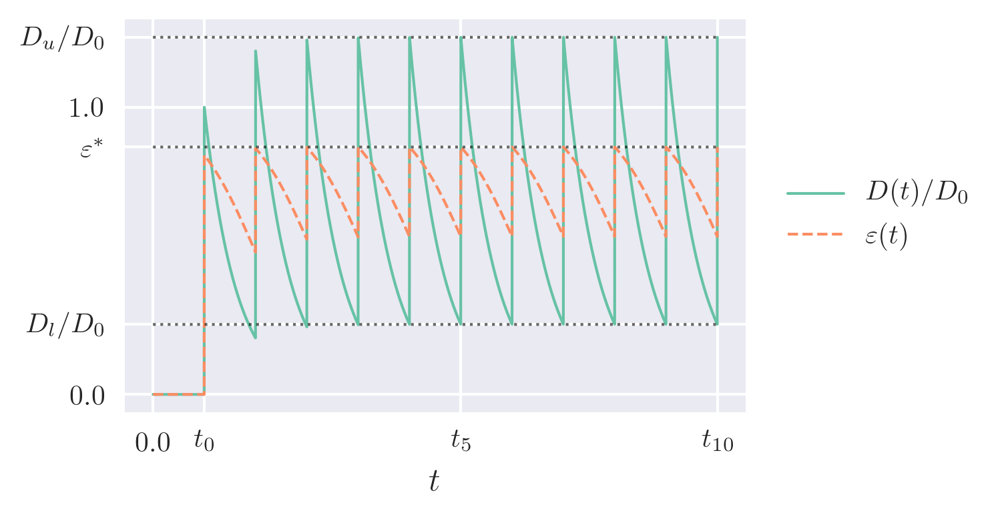
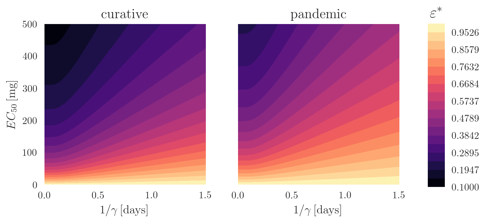

Table of Contents
=================

* [Overview](#overview)
* [Within\-host efficacy of neuraminidase inhibitors](#within-host-efficacy-of-neuraminidase-inhibitors)

# Overview

**Note:** This is only the within-host code. Full repository accessible from [systemsmedicine](https://github.com/systemsmedicine/neuraminidase-inhibitors)

This repository is provided as a companion to the paper *Neuraminidase inhibitors---is it time to call it a day?*, which can be obtained from [bioRxiv](https://www.biorxiv.org/content/early/2018/01/10/245175), and which we also provide here for completeness.

We explore the effects of therapy with NAIs using the within-host model of influenza by [Lukens *et al.* (2014)](https://bmcpublichealth.biomedcentral.com/articles/10.1186/1471-2458-14-1019), which includes symptoms, and which we expand with a simple description of the antiviral drug. The system is given by

where  are susceptible target cells,  infected cells,  productively infected cells,  the viral load,  the symptoms intensity and  the drug concentration.

This simplified by considering a *best-case scenario*, in which the drug stays at a constant concentration given by the peak  at which it quickly converges, resulting in a constant efficacy , as shown below ( corresponds to the time of the -th drug intake).

Using this constant-efficacy within-host model, we explore the impact of treatment as a function of the efficacy and time of initiation post-infection.

Focusing on the prophylactic scenario, we further assess the effectiveness of NAIs in containing an epidemic in a given population, considering the drug coverage and availability/cost.

Our results suggest that the use of NAIs is unwarranted in practical treatment settings, while its large cost-effectiveness ratio cast doubts on their prophylactic use.

The following directories are part of this repository:

- `code` contains the source code necessary to reproduce the within-host results.
- `figures` contains outputs from the code.
- `eqs` simply contains renderings of the LaTeX equations appearing on this page.

# Within-host efficacy of neuraminidase inhibitors

The code corresponding to the within-host analysis is provided here as an interactive Jupyter notebook (see [jupyter.org](https://jupyter.org/)): `within-host.ipynb`. It has been tested and should run with no issues in both Python 2 and 3.

Our main analytical result corresponds to expressing the peak drug efficacy  as a function of the drug parameters, as shown below.

Here, the horizontal axis shows the mean life of the drug, while the vertical axis corresponds to its half-maximal concentration. The curative and pandemic regimens correspond, respectively, to a dose of 75 and 150 mg, taken twice a day.

**Note:** for visualisation-only purposes the notebook can be directly displayed in Github by simply clicking on it. However, we recommend using [this link](https://nbviewer.jupyter.org/github/systemsmedicine/neuraminidase-inhibitors/blob/master/code/within-host.ipynb).
